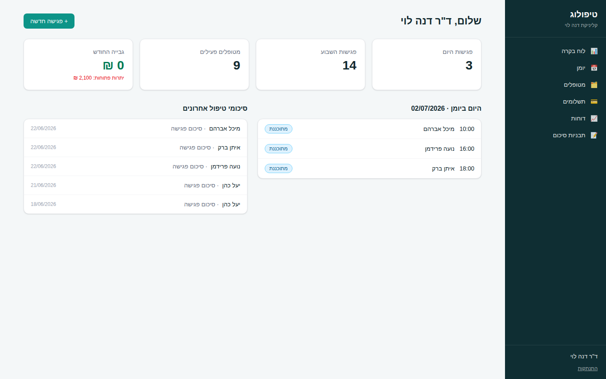

# טיפולוג – מערכת ניהול קליניקה למטפלים פרטיים

Tipulog-style clinic management system for private practitioners (therapists, psychologists,
social workers, coaches). Hebrew, RTL, built with Next.js.



## Features

- **מטופלים (Patients)** – searchable patient registry, full patient file with tabs:
  personal details, appointment history, session notes, and payments/balance.
- **יומן (Calendar)** – weekly RTL calendar grid (Sunday–Saturday), click a slot to book,
  color-coded appointment statuses (scheduled / completed / cancelled / no-show).
- **סיכומי טיפול (Clinical notes)** – session notes per patient/appointment, with reusable
  note templates ("smart form" skeletons) managed in a dedicated screen.
- **תשלומים (Billing lite)** – record payments (cash / transfer / check / card), automatic
  running receipt numbers, per-patient balance (completed sessions − payments), printable receipt.
- **מסמכים (Documents)** – upload files to a patient's file (up to 20MB each); stored on local
  disk by default or in any S3-compatible cloud storage (AWS S3 / Cloudflare R2 / Backblaze / MinIO).
- **וואטסאפ (WhatsApp bot)** – patients book, view and cancel appointments by messaging the
  clinic's WhatsApp number. Free slots are computed from working hours and the live calendar.
  Twilio-compatible webhook (`/api/whatsapp/webhook`) + a built-in chat simulator to try the
  flow without any external account.
- **תזכורות (WhatsApp reminders)** – automatic reminder to each patient before their
  appointment (configurable hours-before and message template with placeholders), sent at most
  once per appointment. Runs on a background scheduler while the server is up, with a manual
  "send now" button and a cron-friendly endpoint (`POST /api/reminders/run`). Without Twilio
  credentials reminders run in a visible "simulated" mode.
- **דוחות (Reports)** – sessions log and collections reports with date-range filter and
  CSV export (UTF-8 BOM so Hebrew opens correctly in Excel).
- **לוח בקרה (Dashboard)** – today's schedule, weekly session count, active patients,
  monthly collections and open balances.
- **Auth** – email + password registration/login (bcrypt), signed HTTP-only session cookie (JWT).

## Tech stack

- [Next.js](https://nextjs.org) (App Router, Server Actions) + TypeScript
- Tailwind CSS v4, RTL layout
- SQLite via [better-sqlite3](https://github.com/WiseLibs/better-sqlite3) +
  [Drizzle ORM](https://orm.drizzle.team) (schema in `src/db/schema.ts`)
- `jose` (session JWT), `bcryptjs` (password hashing)

The SQLite schema is bootstrapped automatically on first run (`src/db/index.ts`),
so no migration step is needed for local development. `drizzle.config.ts` is included
for generating migrations when moving to a managed database later.

## Getting started

```bash
npm install
npm run db:seed     # optional: demo practitioner + 10 patients, appointments, notes, payments
npm run dev
```

Open http://localhost:3000.

Demo login (after seeding):

- **Email:** `demo@tipulog.local`
- **Password:** `demo1234`

Or register a fresh account at `/register`.

## Configuration

| Env var | Default | Purpose |
| --- | --- | --- |
| `SESSION_SECRET` | dev fallback | Secret for signing session JWTs — set in production |
| `DATABASE_FILE` | `./data/tipulog.db` | SQLite database location |
| `UPLOADS_DIR` | `./data/uploads` | Local document storage directory |
| `STORAGE_DRIVER` | `local` | Set to `s3` to store documents in S3-compatible cloud storage |
| `S3_BUCKET` / `S3_REGION` / `S3_ACCESS_KEY_ID` / `S3_SECRET_ACCESS_KEY` / `S3_ENDPOINT` | – | Cloud storage credentials (`S3_ENDPOINT` only for non-AWS providers like Cloudflare R2) |
| `TWILIO_AUTH_TOKEN` | – | When set, incoming WhatsApp webhooks are signature-validated; also used for outbound sending |
| `WHATSAPP_WEBHOOK_URL` | request URL | Public webhook URL used for signature validation behind proxies |
| `TWILIO_ACCOUNT_SID` / `TWILIO_WHATSAPP_FROM` | – | Outbound WhatsApp sending (reminders). Without them reminders are recorded in "simulated" mode |
| `REMINDERS_CRON_SECRET` | – | Allows an external cron to trigger `POST /api/reminders/run` for all clinics via the `x-cron-secret` header |

### WhatsApp booking

Configure working hours, slot length and default price in the **וואטסאפ** screen, enable the
feature, and try it with the built-in simulator. For real traffic, connect a WhatsApp Business
sender via Twilio and point its incoming-message webhook to `POST /api/whatsapp/webhook`.
Patients are matched by their phone number in the patient file; appointments booked this way
appear in the calendar marked "נקבע בוואטסאפ".

### WhatsApp reminders

Enable reminders in the **וואטסאפ** screen and choose how many hours before the appointment to
send (default 24) and the message template (placeholders: `{שם}`, `{קליניקה}`, `{יום}`,
`{תאריך}`, `{שעה}`). Each appointment is reminded exactly once. While the server runs, due
reminders go out automatically every 5 minutes (see `src/instrumentation.ts`); for serverless
deployments point a cron at `POST /api/reminders/run` with the `x-cron-secret` header. The
last 10 reminders and their delivery status are shown at the bottom of the screen.

## Deployment (web)

The app stores its data in a SQLite file plus a local uploads directory, so it needs a host
with a **persistent disk and a long-running Node process** (serverless platforms like Vercel
are not supported as-is):

- **VPS (recommended)** – Node 22 + pm2 + Nginx + Certbot HTTPS. Full Hebrew walkthrough in
  `docs/installation-guide-he.pdf` (chapters 9–13).
- **Docker** – `Dockerfile` + `docker-compose.yml` included; data persists in the
  `tipulog-data` volume mounted at `/app/data`.
- **Railway / Render** – deploy straight from GitHub (Dockerfile auto-detected); add a
  persistent volume mounted at `/app/data` and set `SESSION_SECRET`.

Production checklist: unique `SESSION_SECRET`, HTTPS only, daily backup of `data/`, Twilio
webhook pointed at `https://your-domain/api/whatsapp/webhook`, and an external cron for
reminders on platforms that sleep idle services.

## Project structure

```
src/
├── app/
│   ├── (auth)/          # login, register + auth server actions
│   ├── (app)/           # authenticated shell (sidebar nav)
│   │   ├── dashboard/
│   │   ├── calendar/    # week view, new/edit appointment
│   │   ├── patients/    # list, new, patient file (tabs)
│   │   ├── payments/    # payments list + printable receipt
│   │   ├── reports/     # sessions & collections + CSV export
│   │   └── templates/   # note templates
│   └── api/reports/csv/ # CSV export endpoint
├── components/          # shared UI, patient/appointment forms
├── db/                  # drizzle schema, connection + bootstrap, seed
└── lib/                 # auth, session, formatting, labels, queries
```
